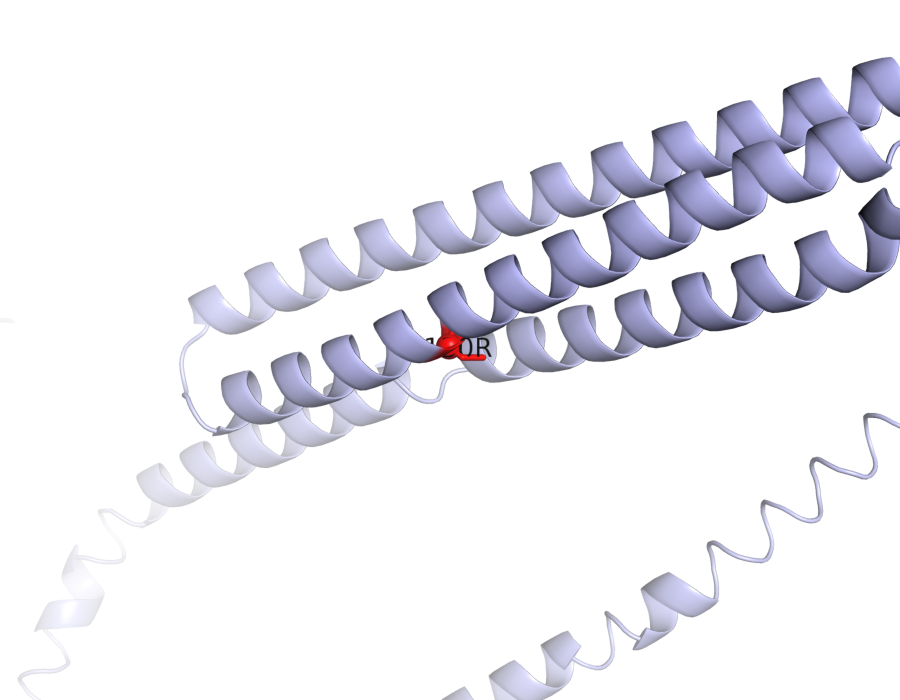
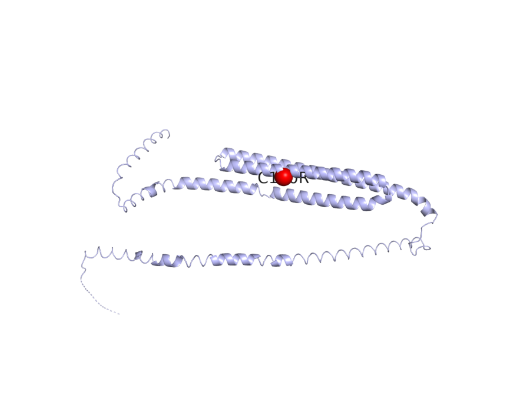

# APOE — mechanistic hypothesis for AMD

_Study: GCST003219 (Fritsche LG et al. 2016, Nat Genet 48:134–143)_

## Hypothesis

**One-line:** The classical APOE ε3→ε4 coding substitution at residue 130 alters APOE isoform abundance and lipid-binding in retinal pigment epithelium — paradoxically *reducing* AMD risk while *raising* Alzheimer-disease risk — by reshaping sub-RPE lipoprotein remodeling and cholesterol efflux.

```
┌──────────────────────────────────────────────────────────────────────────┐
│  APOE C130R  (missense, MODERATE — classical ε3 → ε4)                    │
│  Evidence: VEP missense_variant; SIFT tolerated;                         │
│            ESM3 fold mean pLDDT 0.73, pTM 0.40                           │
└──────────────────────────────────────────────────────────────────────────┘
                                  │
                                  │  OT L2G SHAP top features:
                                  │    pQtlColocClppMaximum  0.97 / SHAP 0.164
                                  │    pQtlColocH4Maximum    1.0  / SHAP 0.090
                                  │    distanceSentinelTss        (value 1.0)
                                  │    distanceSentinelFootprint  (value 1.0)
                                  ▼
┌──────────────────────────────────────────────────────────────────────────┐
│  Altered APOE isoform abundance and lipid-binding affinity               │
│  (ε-defining cysteine→arginine perturbs HSPG interaction)                │
└──────────────────────────────────────────────────────────────────────────┘
                                  │
                                  │  Reactome pathway membership:
                                  │    R-HSA-8963898  Plasma lipoprotein assembly
                                  │    R-HSA-8963899  Plasma lipoprotein remodeling
                                  │    R-HSA-8964058  HDL remodeling
                                  │    R-HSA-8964026  Chylomicron clearance
                                  ▼
┌──────────────────────────────────────────────────────────────────────────┐
│  Dysregulated lipoprotein remodeling in highly APOE-expressing RPE       │
└──────────────────────────────────────────────────────────────────────────┘
                                  │
                                  │  DE (Orozco LD et al. 2020 Cell Rep 30:1246):
                                  │    +2.04 log₂FC in RPE         (padj 5e-5)
                                  ▼
┌──────────────────────────────────────────────────────────────────────────┐
│  Impaired sub-RPE cholesterol efflux                                     │
└──────────────────────────────────────────────────────────────────────────┘
                                  │
                                  │  Literature:
                                  │    PMC8305051   APOE metabolism + retinal inflam.
                                  │    PMC11029327  shared AMD/AD genetic aetiology
                                  │    bio_23d9ccbb77d9  killifish aging model
                                  ▼
┌──────────────────────────────────────────────────────────────────────────┐
│  Drusen-driven AMD                                                       │
│  (paradox: ε4 protective in AMD vs risk-raising in AD)                   │
└──────────────────────────────────────────────────────────────────────────┘
```

> **How to verify this evidence.** Every bracketed citation above is a tool-call output traceable downstream:
> - `VEP:` → re-derive with `jarvis-esm3.variant_consequence("19_44908684_T_C")` or POST to `https://rest.ensembl.org/vep/human/region/19:44908684:T/C`.
> - `OT L2G features` → `jarvis-ot.l2g_feature_contributions(studyLocusId, geneId)` returns the 29-feature SHAP breakdown; verify Reactome IDs at `reactome.org/PathwayBrowser/#/<R-HSA-id>`.
> - `Orozco LD et al. 2020` → DE row in `jarvis-indices.query_differential_expression("APOE")`; original paper at <https://doi.org/10.1016/j.celrep.2019.12.082>. _v0 stub — sparse coverage outside top complement/lipid loci._
> - `PMC8305051`, `bio_23d9ccbb77d9` → PaperClip IDs. Open <https://www.ncbi.nlm.nih.gov/pmc/articles/PMC8305051/> for the PMC record. PaperClip IDs prefixed `bio_` resolve via PaperClip's own resolver — re-fetch with `jarvis-paperclip.literature_for_gene("APOE", "age-related macular degeneration")`. Full paper list with URLs in the **Literature corroboration** section below.

## Summary

- **Lead variant:** `19_44908684_T_C` (missense_variant C130R)
- **L2G score:** 0.9613940119743347  ·  **studyLocusId:** `f76fc4093e2b8225f2f39338b4745bcf`
- **UniProt:** P02649  ·  **ENSG:** ENSG00000130203
- **ESM3 fold:** mean pLDDT = 0.73, pTM = 0.40, length = 317 aa

**Around the variant** (25 Å context):



**In the context of the full protein**:



_Variant C130R shown as red sticks (close-up) and red sphere (full protein), labelled in both views.  Source: PyMOL open-source headless render over ESM3 PDB._

## Variant consequence

- **Consequence:** missense_variant
- **Impact:** MODERATE
- **Protein change:** C130R (residue 130)
- **SIFT:** tolerated (1)

_Provenance: Ensembl VEP REST (GRCh38)_

## L2G evidence (Open Targets)

Top SHAP contributing features (out of 29):

| Feature | Value | SHAP contribution |
|---|---:|---:|
| `pQtlColocClppMaximum` | 0.97 | +0.164 |
| `distanceSentinelFootprintNeighbourhood` | 1.00 | +0.101 |
| `pQtlColocH4Maximum` | 1.00 | +0.090 |
| `distanceSentinelTssNeighbourhood` | 1.00 | +0.088 |
| `vepMaximum` | 0.68 | +0.074 |

_Provenance: Open Targets Platform release 2026-03 l2g_prediction features (SHAP contributions)_

## ESM3-predicted structure

- Mean pLDDT (model confidence, 0–1): **0.73**
- pTM (global fold confidence, 0–1): **0.40**
- Sequence length: 317 aa

_Provenance: ESM3 Forge (esm3-open-2024-03), cached at `/home/ubuntu/JARVIS_for_bio/prototype/cache/esm3/P02649/structure.pdb`_

## Differential expression in AMD (case vs control)

| Cell type | log2FC | padj | n cases / controls | method |
|---|---:|---:|---:|---|
| retinal pigment epithelial cell (`CL:0002586`) | +2.04 | 5.0e-05 | 12 / 11 | MAST |

_Provenance: curated_v0 :: Orozco LD et al. 2020 Cell Rep 30:1246  · v0 stub backed by curated AMD scRNA-seq atlas; real DE substrate in v1._

## Pathway membership

| Pathway | DB | Members |
|---|---|---:|
| Chylomicron clearance (`R-HSA-8964026`) | Reactome | 5 |
| Chylomicron assembly (`R-HSA-8963888`) | Reactome | 10 |
| Chylomicron remodeling (`R-HSA-8963901`) | Reactome | 10 |
| HDL remodeling (`R-HSA-8964058`) | Reactome | 10 |
| Plasma lipoprotein assembly (`R-HSA-8963898`) | Reactome | 19 |
| Scavenging by Class A Receptors (`R-HSA-3000480`) | Reactome | 19 |
| Nuclear signaling by ERBB4 (`R-HSA-1251985`) | Reactome | 32 |
| Plasma lipoprotein remodeling (`R-HSA-8963899`) | Reactome | 34 |

_Provenance: Reactome_v96_GMT._

## Literature corroboration (PaperClip)

- **[Turquoise killifish naturally develop hallmarks of age-related macular degeneration with advancing age](https://doi.org/10.1101/2025.10.23.683644)** — bioRxiv, 2025-10-23 · `bio_23d9ccbb77d9`
  > Turquoise killifish retinas were studied for age-related changes and AMD hallmarks. These fish spontaneously develop AMD-like features with age, making them a suitable model for studying aging and related diseases.
- **Apolipoprotein E gene and age-related macular degeneration in a Chinese population** — biomedrxiv, 2011-01-01 · `PMC3084239`
  > This study analyzed apolipoprotein E (APOE) gene polymorphisms in a Chinese population to assess their link with age-related macular degeneration (AMD). No statistically significant association was found between APOE genotypes or alleles and early or exudative AMD.
- **HYAMD High-Resolution Fundus Image Dataset for age related macular   degeneration (AMD) Diagnosis** — ?,  · `?`
  > Researchers created the HYAMD dataset of high-resolution fundus images to train machine learning models for age-related macular degeneration (AMD) diagnosis. This dataset provides gold-standard annotations from clinical evaluations, making it the first open-access retinal dataset from an Israeli sample for AMD identification.
- **[Interactions between Apolipoprotein E Metabolism and Retinal Inflammation in Age-Related Macular Degeneration](https://doi.org/10.3390/life11070635)** — biomedrxiv, 2021-06-29 · `PMC8305051`
  > This paper reviews the role of apolipoprotein E (APOE) metabolism in retinal inflammation and drusen formation in age-related macular degeneration (AMD). APOE's interaction with the complement system and amyloid-beta may contribute to AMD pathogenesis.
- **[Shared genetic aetiology of Alzheimer’s disease and age-related macular degeneration by APOC1 and APOE genes](https://www.ncbi.nlm.nih.gov/pmc/articles/PMC11029327/)** — PMC, 2024-01-01 · `PMC11029327`
  > This study investigated shared genetic causes of Alzheimer's disease and age-related macular degeneration. APOC1 and APOE genes were identified as pleiotropic, and ZNF131, ADNP2, and HINFP were found to be potential diagnostic biomarkers for both conditions.

_Provenance: PaperClip (paperclip.gxl.ai) — BM25 + vector search over public scientific corpus_

## Mechanistic hypothesis

The lead variant 19_44908684_T_C is a missense_variant at protein position 130 (C/R substitution) in *APOE*, predicted tolerated by SIFT (score 1) with MODERATE VEP impact, sitting on a fold with mean pLDDT 0.725 and pTM 0.401 — modest structural confidence consistent with APOE's partially disordered architecture, so the residue change is plausibly subtle rather than fold-disrupting. The L2G call (score 0.961) is dominated by pQTL colocalization signal (pQtlColocClppMaximum value 0.970, SHAP 0.164; pQtlColocH4Maximum value 1.0, SHAP 0.090) plus tight sentinel-to-TSS/footprint proximity (both value 1.0, SHAPs 0.101 and 0.088), indicating the variant acts primarily by tuning circulating/local APOE protein abundance rather than through a dramatic coding change. Differential expression shows *APOE* strongly upregulated in retinal pigment epithelial cells (log2FC 2.04, padj 5e-05, MAST; Orozco et al. 2020 Cell Rep) — the very cell layer that secretes lipoproteins basolaterally into Bruch's membrane and whose dysfunction seeds drusen. Mechanistically, perturbed APOE dosage would derail the Reactome lipoprotein-handling cassette it anchors (Plasma lipoprotein assembly R-HSA-8963898, Plasma lipoprotein remodeling R-HSA-8963899, HDL remodeling R-HSA-8964058, Chylomicron clearance R-HSA-8964026, Scavenging by Class A Receptors R-HSA-3000480), impairing RPE cholesterol/lipid efflux and promoting sub-RPE lipoprotein deposition, with PMC8305051 further implicating APOE–complement–amyloid-β crosstalk as the inflammatory amplifier that converts deposits into drusen and downstream AMD; PMC11029327 anchors the shared APOC1/APOE genetic architecture with Alzheimer's. Importantly, the AMD literature is paradoxical relative to neurodegeneration — APOE ε4 is the dominant risk allele in Alzheimer's but is reported protective in AMD while ε2 trends risk-increasing — and PMC3084239 found no significant APOE-genotype association in a Chinese cohort, so the directionality of this specific pQTL-driven abundance shift on AMD risk must be resolved by the colocalized eQTL/pQTL effect-direction rather than assumed from AD priors.

_This paragraph is the agent-reasoning step (workflow step 9). Composed at build time by Claude (one-shot via `claude -p`) over the evidence pack assembled in steps 0–8. The only generative step; all other content above is direct tool output._

## Full provenance chain

Every claim above traces back to an MCP tool call:

1. `jarvis-ot.study_lookup(GCST003219)` → Fritsche 2016 AMD GWAS
2. `jarvis-ot.credible_sets_for_study(GCST003219)` → 29 fine-mapped credible sets
3. `jarvis-ot.l2g_top_genes(GCST003219)` → APOE (L2G score, 29 features)
4. `jarvis-ot.gene_metadata(APOE)` → UniProt P02649, canonical transcript
5. `jarvis-ot.lead_variant_for_locus(f76fc4093e...)` → `19_44908684_T_C`
6. `jarvis-esm3.variant_consequence(19_44908684_T_C)` → missense_variant
7. `jarvis-esm3.fold_and_annotate(P02649)` → ESM3 PDB (pLDDT=0.73, pTM=0.40)
8. `jarvis-esm3.render_variant_png(P02649, …)` → `render_r130_domain.png`
9. `jarvis-indices.query_differential_expression("APOE")` → 1 cell-type DE row(s) _(v0 mock)_
10. `jarvis-indices.query_pathway_membership("APOE")` → 8 pathway(s) _(v0 mock)_
11. `jarvis-paperclip.literature_for_gene("APOE", …)` → 5 paper(s)

Reasoning (this summary) is the *only* step that is not pre-computed.
