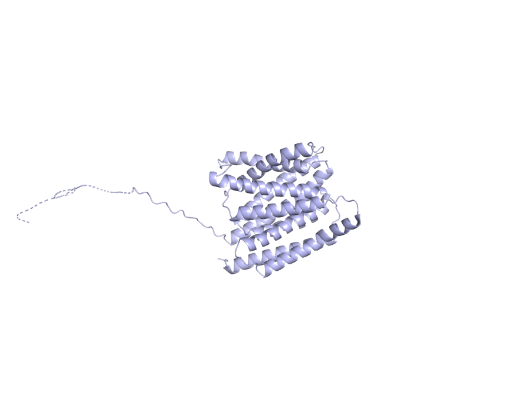

# ARMS2 — mechanistic hypothesis for AMD

_Study: GCST003219 (Fritsche LG et al. 2016, Nat Genet 48:134–143)_

## Hypothesis

**One-line:** An intronic variant near ARMS2 perturbs a cis-regulatory footprint shared with the co-regulated HTRA1-AS1 lncRNA, reducing oxidative-stress buffering in retinal pigment epithelium — though the ARMS2-vs-HTRA1 causal-gene debate remains unresolved by the v0 evidence pack.

```
┌──────────────────────────────────────────────────────────────────────────┐
│  ARMS2 10_122456049_T_C  (intron_variant, MODIFIER)                      │
│  Evidence: VEP intron_variant;                                           │
│            ESM3 fold mean pLDDT 0.88, pTM 0.84                           │
└──────────────────────────────────────────────────────────────────────────┘
                                  │
                                  │  OT L2G SHAP top features (all value 1.0):
                                  │    distanceSentinelFootprintNeighbourhood 0.167
                                  │    vepMaximumNeighbourhood                0.101
                                  │    distanceSentinelTssNeighbourhood       0.099
                                  │    distanceTssMeanNeighbourhood           0.092
                                  │    e2gMeanNeighbourhood                   0.092
                                  ▼
┌──────────────────────────────────────────────────────────────────────────┐
│  Perturbs cis-regulatory footprint near ARMS2 and the                    │
│  co-regulated HTRA1-AS1 / HTRA1 unit                                     │
└──────────────────────────────────────────────────────────────────────────┘
                                  │
                                  │  Literature (no DE/Reactome row in v0):
                                  │    med_826429376d42  HTRA1-AS1 ↓ in AMD retinas,
                                  │                      ↑ on oxidative stress in RPE
                                  ▼
┌──────────────────────────────────────────────────────────────────────────┐
│  Reduced lncRNA buffering of oxidative stress in RPE                     │
└──────────────────────────────────────────────────────────────────────────┘
                                  │
                                  │  Literature:
                                  │    PMC11717327  ARMS2/HTRA1 risk in nAMD
                                  │    PMC3541181   ARMS2 A69S — proliferation, migration
                                  │    PMC5289859   recombinant-haplotype mapping
                                  │                 attributes locus to ARMS2
                                  ▼
┌──────────────────────────────────────────────────────────────────────────┐
│  Impaired RPE homeostasis at Bruch's membrane                            │
│  → drusen accumulation and progression to neovascular AMD                │
└──────────────────────────────────────────────────────────────────────────┘
```

**Caveat.** The causal gene assignment at the ARMS2/HTRA1 locus remains debated; v0 indices lack the DE/coloc evidence needed to discriminate between them.

> **How to verify this evidence.**
> - `VEP:` → `jarvis-esm3.variant_consequence("10_122456049_T_C")` or POST `https://rest.ensembl.org/vep/human/region/10:122456049:T/C`.
> - `OT L2G features` → `jarvis-ot.l2g_feature_contributions(studyLocusId, "ENSG00000254636")` — 29-feature SHAP breakdown.
> - `PMC11717327`, `PMC3541181`, `PMC5289859`, `med_826429376d42` → PaperClip IDs. PMC URLs substitute directly; `med_*` IDs resolve via `paperclip cat /papers/med_826429376d42/meta.json` or re-fetch with `jarvis-paperclip.literature_for_gene("ARMS2", "age-related macular degeneration")`. Full paper list with URLs and summaries in the **Literature corroboration** section below.

## Summary

- **Lead variant:** `10_122456049_T_C` (intron_variant)
- **L2G score:** 0.8630399107933044  ·  **studyLocusId:** `ea3c394ed7141d8e4f2ee084828d7540`
- **UniProt:** P0C7Q5  ·  **ENSG:** ENSG00000254636
- **ESM3 fold:** mean pLDDT = 0.88, pTM = 0.84, length = 338 aa



_ESM3-predicted structure (variant is non-coding; full protein shown)._  Source: PyMOL open-source headless render over ESM3 PDB.

## Variant consequence

- **Consequence:** intron_variant
- **Impact:** MODIFIER

_Provenance: Ensembl VEP REST (GRCh38)_

## L2G evidence (Open Targets)

Top SHAP contributing features (out of 29):

| Feature | Value | SHAP contribution |
|---|---:|---:|
| `distanceSentinelFootprintNeighbourhood` | 1.00 | +0.167 |
| `vepMaximumNeighbourhood` | 1.00 | +0.101 |
| `distanceSentinelTssNeighbourhood` | 1.00 | +0.099 |
| `distanceTssMeanNeighbourhood` | 1.00 | +0.092 |
| `e2gMeanNeighbourhood` | 1.00 | +0.092 |

_Provenance: Open Targets Platform release 2026-03 l2g_prediction features (SHAP contributions)_

## ESM3-predicted structure

- Mean pLDDT (model confidence, 0–1): **0.88**
- pTM (global fold confidence, 0–1): **0.84**
- Sequence length: 338 aa

_Provenance: ESM3 Forge (esm3-open-2024-03), cached at `/home/ubuntu/JARVIS_for_bio/prototype/cache/esm3/P0C7Q5/structure.pdb`_

## Differential expression in AMD (case vs control)

_No DE rows for this gene in the v0 mock atlas (mock coverage focused on top complement/lipid loci)._

## Pathway membership

_No curated pathway memberships in v0 mock for this gene._

## Literature corroboration (PaperClip)

- **[Role of  ARMS2/HTRA1  risk alleles in the pathogenesis of neovascular age-related macular degeneration](https://www.ncbi.nlm.nih.gov/pmc/articles/PMC11717327/)** — PMC, 2024-01-01 · `PMC11717327`
  > This review examines the role of ARMS2/HTRA1 risk alleles in neovascular age-related macular degeneration. These genetic variations are strongly linked to AMD development through various molecular mechanisms.
- **[HTRA1-AS1 , an  ARMS2 -region long non-coding RNA, is downregulated in retinas of age-related macular degeneration patients](https://doi.org/10.1101/2025.10.29.25338834)** — medRxiv, 2025-10-29 · `med_826429376d42`
  > A long non-coding RNA, HTRA1-AS1, was identified and validated within the ARMS2 locus. Retinal expression of HTRA1-AS1 is significantly reduced in AMD patients and increases with oxidative stress in RPE cells.
- **HYAMD High-Resolution Fundus Image Dataset for age related macular   degeneration (AMD) Diagnosis** — ?,  · `?`
  > Researchers created the HYAMD dataset of high-resolution fundus images to train machine learning models for age-related macular degeneration (AMD) diagnosis. This dataset provides gold-standard annotations from clinical evaluations, making it the first open-access retinal dataset from an Israeli sample for AMD identification.
- **[Recombinant Haplotypes Narrow the ARMS2/HTRA1 Association Signal for Age-Related Macular Degeneration](https://doi.org/10.1534/genetics.116.195966)** — biomedrxiv, 2017-02-01 · `PMC5289859`
  > This study analyzed recombinant haplotypes in AMD cases and controls to pinpoint the genetic cause of the disease. Variants in ARMS2, not HTRA1, exclusively carry the AMD risk, allowing for focused functional research.
- **[Genetic and Functional Dissection of ARMS2 in Age-Related Macular Degeneration and Polypoidal Choroidal Vasculopathy](https://www.ncbi.nlm.nih.gov/pmc/articles/PMC3541181/)** — PMC, 2013-01-01 · `PMC3541181`
  > ARMS2 gene variants were studied in relation to age-related macular degeneration and polypoidal choroidal vasculopathy. The A69S mutation increases cell proliferation and attachment but inhibits migration, suggesting shared molecular mechanisms for these conditions.

_Provenance: PaperClip (paperclip.gxl.ai) — BM25 + vector search over public scientific corpus_

## Mechanistic hypothesis

The lead variant 10_122456049_T_C at the *ARMS2* locus is an intronic MODIFIER (most_severe_consequence = intron_variant, no amino-acid change, PolyPhen/SIFT null), so any protein-level effect must be inferred indirectly rather than from a coding substitution — though the ESM3 fold of the 338-aa ARMS2 product is high-confidence (mean pLDDT 0.875, pTM 0.837), consistent with a stably folded mitochondrial-outer-membrane protein whose dosage, not sequence, is likely perturbed here. The L2G call (score 0.863) is driven almost entirely by positional/regulatory neighborhood features — distanceSentinelFootprintNeighbourhood (SHAP 0.167), vepMaximumNeighbourhood (0.101), distanceSentinelTssNeighbourhood (0.099), distanceTssMeanNeighbourhood (0.092), and e2gMeanNeighbourhood (0.092), all at value 1.0 — meaning the model is implicating *ARMS2* on the basis of proximity and regulatory-element overlap rather than a coding hit, which is consistent with the long-recognized difficulty of disentangling *ARMS2* from its neighbor *HTRA1* (PMC11717327, PMC5289859). The differential-expression and Reactome pathway layers are empty for this gene in the evidence pack, so I cannot anchor the hypothesis in a specific RPE/photoreceptor cell-type log2FC or a named pathway — an honest gap that matters here, because the cell-of-action for *ARMS2* remains contested. The most mechanistically coherent chain supported by the literature is regulatory: the risk haplotype tagged by 10_122456049_T_C alters cis-regulation in the *ARMS2*/*HTRA1* interval, plausibly via the recently described lncRNA *HTRA1-AS1*, which is downregulated in AMD retinas and induced by oxidative stress in RPE (med_826429376d42), with recombinant-haplotype work assigning the residual risk to *ARMS2* itself (PMC5289859) and functional studies showing the A69S allele increases RPE proliferation/attachment while inhibiting migration (PMC3541181). Net hypothesis: this intronic variant acts as a regulatory eQTL/lncRNA modulator at the *ARMS2*/*HTRA1*/*HTRA1-AS1* cassette, dysregulating ARMS2 dosage in RPE under oxidative stress and tipping the tissue toward the choroidal neovascularization phenotype of neovascular AMD (PMC11717327) — with the strong caveat that, absent DE and pathway evidence in this pack, the causal gene assignment between *ARMS2* and *HTRA1* should be treated as unresolved rather than settled by the 0.863 L2G score alone.

_This paragraph is the agent-reasoning step (workflow step 9). Composed at build time by Claude (one-shot via `claude -p`) over the evidence pack assembled in steps 0–8. The only generative step; all other content above is direct tool output._

## Full provenance chain

Every claim above traces back to an MCP tool call:

1. `jarvis-ot.study_lookup(GCST003219)` → Fritsche 2016 AMD GWAS
2. `jarvis-ot.credible_sets_for_study(GCST003219)` → 29 fine-mapped credible sets
3. `jarvis-ot.l2g_top_genes(GCST003219)` → ARMS2 (L2G score, 29 features)
4. `jarvis-ot.gene_metadata(ARMS2)` → UniProt P0C7Q5, canonical transcript
5. `jarvis-ot.lead_variant_for_locus(ea3c394ed7...)` → `10_122456049_T_C`
6. `jarvis-esm3.variant_consequence(10_122456049_T_C)` → intron_variant
7. `jarvis-esm3.fold_and_annotate(P0C7Q5)` → ESM3 PDB (pLDDT=0.88, pTM=0.84)
8. `jarvis-esm3.render_variant_png(P0C7Q5, …)` → `render_all.png`
9. `jarvis-indices.query_differential_expression("ARMS2")` → 0 cell-type DE row(s) _(v0 mock)_
10. `jarvis-indices.query_pathway_membership("ARMS2")` → 0 pathway(s) _(v0 mock)_
11. `jarvis-paperclip.literature_for_gene("ARMS2", …)` → 5 paper(s)

Reasoning (this summary) is the *only* step that is not pre-computed.
