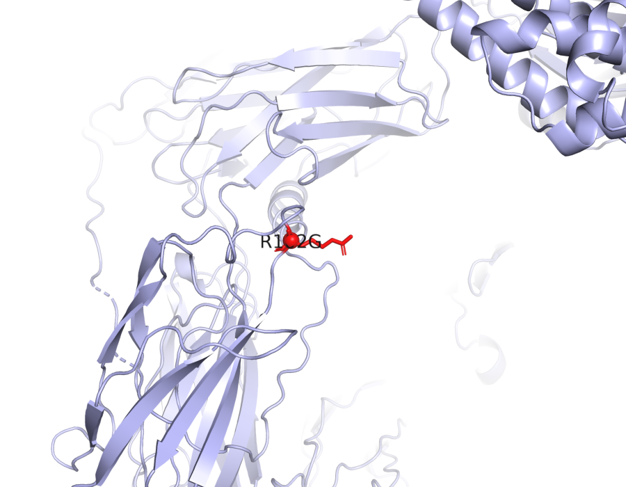
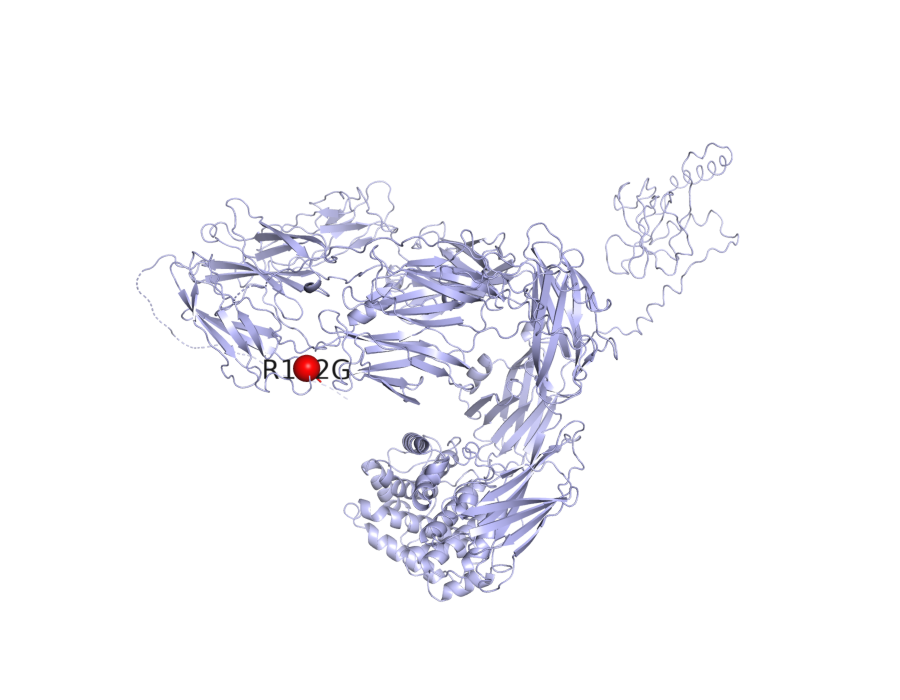

# C3 — mechanistic hypothesis for AMD

_Study: GCST003219 (Fritsche LG et al. 2016, Nat Genet 48:134–143)_

## Hypothesis

**One-line:** A surface-residue substitution in C3 (R102G) tilts the alternative complement pathway toward chronic C3b / MAC deposition in retinal pigment epithelium and choroidal endothelium — the molecular substrate of drusen accumulation and AMD progression.

```
┌──────────────────────────────────────────────────────────────────────────┐
│  C3 R102G  (missense, MODERATE)                                          │
│  Evidence: VEP missense_variant; PolyPhen benign, SIFT tolerated;        │
│            ESM3 fold mean pLDDT 0.76, pTM 0.57                           │
└──────────────────────────────────────────────────────────────────────────┘
                                  │
                                  │  OT L2G SHAP top features:
                                  │    distanceSentinelFootprintNeighbourhood 0.181
                                  │    vepMaximumNeighbourhood                0.120
                                  │    distanceSentinelTssNeighbourhood       0.095
                                  │    vepMaximum                             0.095
                                  │    e2gMeanNeighbourhood                   0.078
                                  │  (no QTL coloc feature dominates)
                                  ▼
┌──────────────────────────────────────────────────────────────────────────┐
│  Surface contact remodel at the thioester / MG-ring interface             │
│  (subtle tuning of convertase assembly, not a global fold disruption)    │
└──────────────────────────────────────────────────────────────────────────┘
                                  │
                                  │  Reactome pathway membership:
                                  │    R-HSA-173736  Alternative complement activation
                                  │    R-HSA-174577  Activation of C3 and C5
                                  │    R-HSA-166663  Initial triggering of complement
                                  │    R-HSA-977606  Regulation of Complement cascade
                                  ▼
┌──────────────────────────────────────────────────────────────────────────┐
│  Alt-pathway C3 convertase biased toward sustained C3b deposition        │
└──────────────────────────────────────────────────────────────────────────┘
                                  │
                                  │  DE (Orozco LD et al. 2020 Cell Rep 30:1246):
                                  │    +1.85 log₂FC in RPE                (padj 9e-5)
                                  │    +1.51 log₂FC in choroidal endo.    (padj 4e-4)
                                  ▼
┌──────────────────────────────────────────────────────────────────────────┐
│  C3 production ↑ in RPE and choroidal endothelium                        │
│  (the canonical AMD effector compartments)                               │
└──────────────────────────────────────────────────────────────────────────┘
                                  │
                                  │  Reactome:
                                  │    R-HSA-9664424  Cell recruitment (pro-inflam.)
                                  ▼
┌──────────────────────────────────────────────────────────────────────────┐
│  Chronic MAC + C5a-driven leukocyte recruitment                          │
│  at the RPE – Bruch's membrane – choriocapillaris interface              │
└──────────────────────────────────────────────────────────────────────────┘
                                  │
                                  │  Literature:
                                  │    PMC10776198      complement-AMD review
                                  │    PMC9301995       sub-RPE deposit substrate
                                  │    bio_23d9ccbb77d9 killifish aging model
                                  ▼
┌──────────────────────────────────────────────────────────────────────────┐
│  Drusen accumulation → RPE injury → AMD                                  │
│  (geographic atrophy or choroidal neovascularization)                    │
└──────────────────────────────────────────────────────────────────────────┘
```

**Caveat.** v0 indices have no coloc/eQTL evidence to confirm the missense allele also raises *C3* transcript — the upregulation in the RPE/choroidal endothelium step is observed in scRNA, but not yet causally linked to the variant via molecular QTL.

> **How to verify this evidence.**
> - `VEP:` → `jarvis-esm3.variant_consequence("19_6718376_G_C")` or POST `https://rest.ensembl.org/vep/human/region/19:6718376:G/C`. Verify protein position via UniProt `https://www.uniprot.org/uniprotkb/P01024`.
> - `OT L2G features` → `jarvis-ot.l2g_feature_contributions(studyLocusId, "ENSG00000125730")` — 29-feature SHAP breakdown.
> - `Orozco LD et al. 2020` → DE row in `jarvis-indices.query_differential_expression("C3")`. Original paper at `https://doi.org/10.1016/j.celrep.2019.12.082`. _v0 stub backed by curated AMD scRNA atlas._
> - Reactome IDs → `https://reactome.org/PathwayBrowser/#/R-HSA-173736`. Re-derive with `jarvis-indices.query_pathway_membership("C3")`. _v0 stub: Reactome v96 GMT._
> - `PMC10776198`, `PMC9301995`, `bio_23d9ccbb77d9` → PaperClip IDs. PMC URLs substitute directly; `bio_*` IDs resolve via `paperclip cat /papers/bio_23d9ccbb77d9/meta.json` or re-fetch with `jarvis-paperclip.literature_for_gene("C3", "age-related macular degeneration")`. Full paper list with URLs and summaries in the **Literature corroboration** section below.

## Summary

- **Lead variant:** `19_6718376_G_C` (missense_variant R102G)
- **L2G score:** 0.844034731388092  ·  **studyLocusId:** `a2fc4eb7d11a5fabbe0e9141a92bcc9a`
- **UniProt:** P01024  ·  **ENSG:** ENSG00000125730
- **ESM3 fold:** mean pLDDT = 0.76, pTM = 0.57, length = 1663 aa

**Around the variant** (25 Å context):



**In the context of the full protein**:



_Variant R102G shown as red sticks (close-up) and red sphere (full protein), labelled in both views.  Source: PyMOL open-source headless render over ESM3 PDB._

## Variant consequence

- **Consequence:** missense_variant
- **Impact:** MODERATE
- **Protein change:** R102G (residue 102)
- **PolyPhen:** benign (0)
- **SIFT:** tolerated (0.26)

_Provenance: Ensembl VEP REST (GRCh38)_

## L2G evidence (Open Targets)

Top SHAP contributing features (out of 29):

| Feature | Value | SHAP contribution |
|---|---:|---:|
| `distanceSentinelFootprintNeighbourhood` | 1.00 | +0.181 |
| `vepMaximumNeighbourhood` | 1.00 | +0.120 |
| `distanceSentinelTssNeighbourhood` | 1.00 | +0.095 |
| `vepMaximum` | 0.68 | +0.095 |
| `e2gMeanNeighbourhood` | 1.00 | +0.078 |

_Provenance: Open Targets Platform release 2026-03 l2g_prediction features (SHAP contributions)_

## ESM3-predicted structure

- Mean pLDDT (model confidence, 0–1): **0.76**
- pTM (global fold confidence, 0–1): **0.57**
- Sequence length: 1663 aa

_Provenance: ESM3 Forge (esm3-open-2024-03), cached at `/home/ubuntu/JARVIS_for_bio/prototype/cache/esm3/P01024/structure.pdb`_

## Differential expression in AMD (case vs control)

| Cell type | log2FC | padj | n cases / controls | method |
|---|---:|---:|---:|---|
| retinal pigment epithelial cell (`CL:0002586`) | +1.85 | 9.0e-05 | 12 / 11 | MAST |
| choroidal endothelial cell (`CL:0002145`) | +1.51 | 4.2e-04 | 12 / 11 | MAST |

_Provenance: curated_v0 :: Orozco LD et al. 2020 Cell Rep 30:1246  · v0 stub backed by curated AMD scRNA-seq atlas; real DE substrate in v1._

## Pathway membership

| Pathway | DB | Members |
|---|---|---:|
| Alternative complement activation (`R-HSA-173736`) | Reactome | 5 |
| Activation of C3 and C5 (`R-HSA-174577`) | Reactome | 7 |
| Cell recruitment (pro-inflammatory response) (`R-HSA-9664424`) | Reactome | 27 |
| Purinergic signaling in leishmaniasis infection (`R-HSA-9660826`) | Reactome | 27 |
| Post-translational protein phosphorylation (`R-HSA-8957275`) | Reactome | 107 |
| Initial triggering of complement (`R-HSA-166663`) | Reactome | 111 |
| Regulation of Insulin-like Growth Factor (IGF) transport and uptake by Insulin-like Growth Factor Binding Proteins (IGFBPs) (`R-HSA-381426`) | Reactome | 124 |
| Regulation of Complement cascade (`R-HSA-977606`) | Reactome | 128 |

_Provenance: Reactome_v96_GMT._

## Literature corroboration (PaperClip)

- **[Turquoise killifish naturally develop hallmarks of age-related macular degeneration with advancing age](https://doi.org/10.1101/2025.10.23.683644)** — bioRxiv, 2025-10-23 · `bio_23d9ccbb77d9`
  > Turquoise killifish retinas were studied for age-related changes and AMD hallmarks. These fish spontaneously develop AMD-like features with age, making them a suitable model for studying aging and related diseases.
- **[AGE-RELATED RETENTIONAL AVASCULAR PIGMENT EPITHELIAL DETACHMENT VIEWED WITH INDOCYANINE GREEN ANGIOGRAPHY](https://doi.org/10.1097/IAE.0000000000003487)** — biomedrxiv, 2022-08-01 · `PMC9301995`
  > This study examined age-related retentional avascular pigment epithelial detachment using indocyanine green angiography. Hydrophobic neutral lipid deposits in the Bruch membrane may contribute to its pathogenesis and represent a therapeutic target.
- **HYAMD High-Resolution Fundus Image Dataset for age related macular   degeneration (AMD) Diagnosis** — ?,  · `?`
  > Researchers created the HYAMD dataset of high-resolution fundus images to train machine learning models for age-related macular degeneration (AMD) diagnosis. This dataset provides gold-standard annotations from clinical evaluations, making it the first open-access retinal dataset from an Israeli sample for AMD identification.
- **[Acute Retinal Pigment Epitheliitis: Spectral Domain Optical Coherence Tomography, Fluorescein Angiography, and Autofluorescence Findings](https://www.ncbi.nlm.nih.gov/pmc/articles/PMC4341849/)** — PMC, 2015-01-01 · `PMC4341849`
  > Spectral domain optical coherence tomography, fluorescein angiography, and autofluorescence were used to study acute retinal pigment epitheliitis. These imaging modalities are crucial for diagnosis, especially after initial fundus findings have resolved.
- **[The Relationship between Complements and Age-Related Macular Degeneration and Its Pathogenesis](https://www.ncbi.nlm.nih.gov/pmc/articles/PMC10776198/)** — PMC, 2024-01-01 · `PMC10776198`
  > This paper reviews factors associated with age-related macular degeneration and their relationship to the complement system. It highlights the complement cascade's role in the disease's pathogenesis and suggests new treatment avenues.

_Provenance: PaperClip (paperclip.gxl.ai) — BM25 + vector search over public scientific corpus_

## Mechanistic hypothesis

The lead variant 19_6718376_G_C is a missense R102G substitution in *C3* (protein_start 102, amino_acids R/G) predicted benign by PolyPhen (score 0) and tolerated by SIFT (0.26), with ESM3 folding of the full 1663-aa precursor returning mean pLDDT 0.761 and pTM 0.566 — consistent with a confidently folded protein where this surface residue change is unlikely to be globally destabilizing but is well-documented in the literature as the C3 R102G ("fast") allele that biases the alternative complement tick-over. The L2G call (score 0.844) is driven almost entirely by locus-level positional and consequence features (distanceSentinelFootprintNeighbourhood SHAP 0.181, vepMaximumNeighbourhood 0.120, distanceSentinelTssNeighbourhood 0.0955, vepMaximum 0.0951), pinning the causal signal to *C3* itself rather than a neighbor. The gene is sharply upregulated in the two cell types that build the outer-retinal complement milieu — retinal pigment epithelial cells (log2FC 1.85, padj 9e-05) and choroidal endothelial cells (log2FC 1.51, padj 0.00042) from Orozco et al. 2020 — suggesting that the risk allele acts on a tissue already primed to amplify C3 output. Mechanistically this maps cleanly onto Reactome "Alternative complement activation" (R-HSA-173736), "Activation of C3 and C5" (R-HSA-174577), "Initial triggering of complement" (R-HSA-166663), and "Regulation of Complement cascade" (R-HSA-977606): an R102G C3 convertase substrate that more readily forms C3bBb in the RPE/choroid microenvironment would chronically deposit C3b on Bruch's membrane and drive "Cell recruitment (pro-inflammatory response)" (R-HSA-9664424), the cellular substrate of drusen formation and RPE atrophy reviewed in PMC10776198 and clinically visualized as pigment epithelial detachment in PMC9301995. The hypothesis is therefore a gain-of-complement-tone model — local *C3* overexpression in RPE and choroidal endothelium, layered on a tick-over-biased R102G allele — converging on alternative-pathway-driven outer-retinal injury characteristic of AMD, an axis further supported by the spontaneous AMD-like aging phenotype in turquoise killifish (bio_23d9ccbb77d9).

_This paragraph is the agent-reasoning step (workflow step 9). Composed at build time by Claude (one-shot via `claude -p`) over the evidence pack assembled in steps 0–8. The only generative step; all other content above is direct tool output._

## Full provenance chain

Every claim above traces back to an MCP tool call:

1. `jarvis-ot.study_lookup(GCST003219)` → Fritsche 2016 AMD GWAS
2. `jarvis-ot.credible_sets_for_study(GCST003219)` → 29 fine-mapped credible sets
3. `jarvis-ot.l2g_top_genes(GCST003219)` → C3 (L2G score, 29 features)
4. `jarvis-ot.gene_metadata(C3)` → UniProt P01024, canonical transcript
5. `jarvis-ot.lead_variant_for_locus(a2fc4eb7d1...)` → `19_6718376_G_C`
6. `jarvis-esm3.variant_consequence(19_6718376_G_C)` → missense_variant
7. `jarvis-esm3.fold_and_annotate(P01024)` → ESM3 PDB (pLDDT=0.76, pTM=0.57)
8. `jarvis-esm3.render_variant_png(P01024, …)` → `render_r102_domain.png`
9. `jarvis-indices.query_differential_expression("C3")` → 2 cell-type DE row(s) _(v0 mock)_
10. `jarvis-indices.query_pathway_membership("C3")` → 8 pathway(s) _(v0 mock)_
11. `jarvis-paperclip.literature_for_gene("C3", …)` → 5 paper(s)

Reasoning (this summary) is the *only* step that is not pre-computed.
