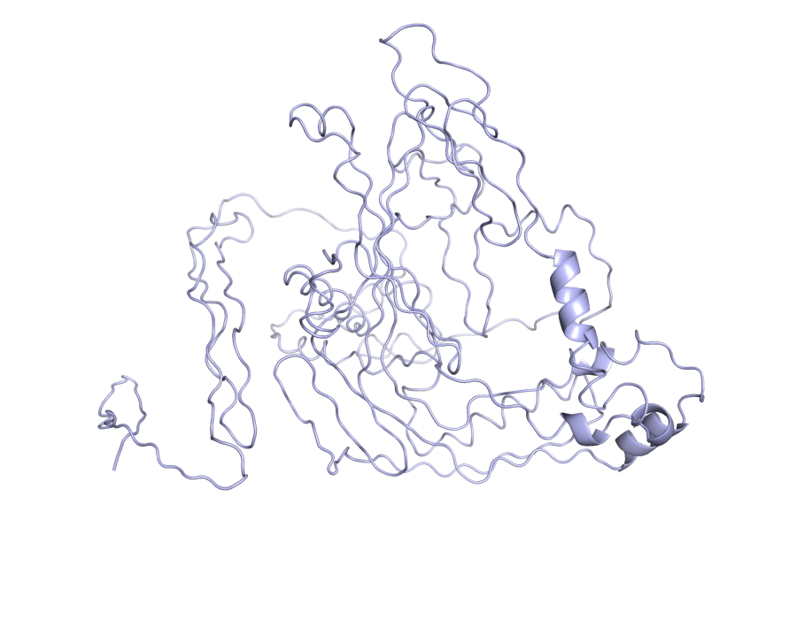

# C9 — mechanistic hypothesis for AMD

_Study: GCST003219 (Fritsche LG et al. 2016, Nat Genet 48:134–143)_

## Hypothesis

**One-line:** An intronic variant cis-regulating C9 expression raises local complement C9 dosage in the RPE-choroid, biasing the terminal complement pathway toward more efficient C5b-9 (MAC) assembly on Bruch's membrane — the cellular substrate of drusen-associated complement injury in advanced AMD.

```
┌──────────────────────────────────────────────────────────────────────────┐
│  C9 5_39327786_G_T  (intron_variant, MODIFIER)                           │
│  Evidence: VEP intron_variant;                                           │
│            ESM3 fold mean pLDDT 0.46, pTM 0.32                           │
│            (flexible MAC/perforin architecture)                          │
└──────────────────────────────────────────────────────────────────────────┘
                                  │
                                  │  OT L2G SHAP top features:
                                  │    distanceSentinelTssNeighbourhood       0.119
                                  │    pQtlColocClppMaximum  0.393 / SHAP    0.118
                                  │    distanceSentinelFootprintNeighbourhood 0.107
                                  ▼
┌──────────────────────────────────────────────────────────────────────────┐
│  Cis-regulates C9 expression                                              │
│  (pQTL coloc corroborates regulatory effect on circulating C9 protein)   │
└──────────────────────────────────────────────────────────────────────────┘
                                  │
                                  │  Reactome pathway membership:
                                  │    R-HSA-166665  Terminal pathway of complement
                                  │    R-HSA-977606  Regulation of Complement cascade
                                  │    R-HSA-166658  Complement cascade
                                  ▼
┌──────────────────────────────────────────────────────────────────────────┐
│  Biases terminal complement toward C5b-9 (MAC) assembly                  │
└──────────────────────────────────────────────────────────────────────────┘
                                  │
                                  │  (no DE row for C9 in v0; cell-type unresolved)
                                  ▼
┌──────────────────────────────────────────────────────────────────────────┐
│  Chronic MAC deposition on Bruch's membrane and RPE                      │
└──────────────────────────────────────────────────────────────────────────┘
                                  │
                                  │  Literature:
                                  │    PMC3902040       rare C9 coding variants in
                                  │                     advanced AMD
                                  │    PMC10776198      complement-AMD synthesis
                                  │    bio_23d9ccbb77d9 killifish aging model
                                  ▼
┌──────────────────────────────────────────────────────────────────────────┐
│  Drusen-associated complement injury in advanced AMD                     │
└──────────────────────────────────────────────────────────────────────────┘
```

> **How to verify this evidence.**
> - `VEP:` → `jarvis-esm3.variant_consequence("5_39327786_G_T")` or POST `https://rest.ensembl.org/vep/human/region/5:39327786:G/T`.
> - `OT L2G features` → `jarvis-ot.l2g_feature_contributions(studyLocusId, "ENSG00000113600")` — 29-feature SHAP breakdown.
> - Reactome IDs → `https://reactome.org/PathwayBrowser/#/R-HSA-166665` (substitute any `R-HSA-id`). Re-derive with `jarvis-indices.query_pathway_membership("C9")`. _v0 stub: Reactome v96 GMT._
> - `PMC3902040`, `PMC10776198`, `bio_23d9ccbb77d9` → PaperClip IDs. PMC URLs substitute directly; `bio_*` IDs resolve via `paperclip cat /papers/<id>/meta.json` or re-fetch with `jarvis-paperclip.literature_for_gene("C9", "age-related macular degeneration")`. Full paper list with URLs and summaries in the **Literature corroboration** section below.

## Summary

- **Lead variant:** `5_39327786_G_T` (intron_variant)
- **L2G score:** 0.960707426071167  ·  **studyLocusId:** `cc85165749abe6ecf46e5e71e5494a96`
- **UniProt:** P02748  ·  **ENSG:** ENSG00000113600
- **ESM3 fold:** mean pLDDT = 0.46, pTM = 0.32, length = 559 aa



_ESM3-predicted structure (variant is non-coding; full protein shown)._  Source: PyMOL open-source headless render over ESM3 PDB.

## Variant consequence

- **Consequence:** intron_variant
- **Impact:** MODIFIER

_Provenance: Ensembl VEP REST (GRCh38)_

## L2G evidence (Open Targets)

Top SHAP contributing features (out of 29):

| Feature | Value | SHAP contribution |
|---|---:|---:|
| `distanceSentinelTssNeighbourhood` | 1.00 | +0.119 |
| `pQtlColocClppMaximum` | 0.39 | +0.118 |
| `distanceSentinelFootprintNeighbourhood` | 1.00 | +0.107 |
| `distanceTssMeanNeighbourhood` | 1.00 | +0.085 |
| `vepMaximum` | 0.68 | +0.083 |

_Provenance: Open Targets Platform release 2026-03 l2g_prediction features (SHAP contributions)_

## ESM3-predicted structure

- Mean pLDDT (model confidence, 0–1): **0.46**
- pTM (global fold confidence, 0–1): **0.32**
- Sequence length: 559 aa

_Provenance: ESM3 Forge (esm3-open-2024-03), cached at `/home/ubuntu/JARVIS_for_bio/prototype/cache/esm3/P02748/structure.pdb`_

## Differential expression in AMD (case vs control)

_No DE rows for this gene in the v0 mock atlas (mock coverage focused on top complement/lipid loci)._

## Pathway membership

| Pathway | DB | Members |
|---|---|---:|
| Terminal pathway of complement (`R-HSA-166665`) | Reactome | 8 |
| Regulation of Complement cascade (`R-HSA-977606`) | Reactome | 128 |
| Complement cascade (`R-HSA-166658`) | Reactome | 146 |

_Provenance: Reactome_v96_GMT._

## Literature corroboration (PaperClip)

- **[Turquoise killifish naturally develop hallmarks of age-related macular degeneration with advancing age](https://doi.org/10.1101/2025.10.23.683644)** — bioRxiv, 2025-10-23 · `bio_23d9ccbb77d9`
  > Turquoise killifish retinas were studied for age-related changes and AMD hallmarks. These fish spontaneously develop AMD-like features with age, making them a suitable model for studying aging and related diseases.
- **[Rare variants in  CFI ,  C3  and  C9  are associated with high risk of advanced age-related macular degeneration](https://www.ncbi.nlm.nih.gov/pmc/articles/PMC3902040/)** — PMC, 2013-10-17 · `PMC3902040`
  > Rare variants in *CFI*, *C3*, and *C9* were studied for their association with age-related macular degeneration (AMD). These variants, particularly in *CFI*, significantly increase the risk of advanced AMD by disrupting complement regulation.
- **HYAMD High-Resolution Fundus Image Dataset for age related macular   degeneration (AMD) Diagnosis** — ?,  · `?`
  > Researchers created the HYAMD dataset of high-resolution fundus images to train machine learning models for age-related macular degeneration (AMD) diagnosis. This dataset provides gold-standard annotations from clinical evaluations, making it the first open-access retinal dataset from an Israeli sample for AMD identification.
- **[AGE-RELATED RETENTIONAL AVASCULAR PIGMENT EPITHELIAL DETACHMENT VIEWED WITH INDOCYANINE GREEN ANGIOGRAPHY](https://doi.org/10.1097/IAE.0000000000003487)** — biomedrxiv, 2022-08-01 · `PMC9301995`
  > This study examined age-related retentional avascular pigment epithelial detachment using indocyanine green angiography. Hydrophobic neutral lipid deposits in the Bruch membrane may contribute to its pathogenesis and represent a therapeutic target.
- **[The Relationship between Complements and Age-Related Macular Degeneration and Its Pathogenesis](https://www.ncbi.nlm.nih.gov/pmc/articles/PMC10776198/)** — PMC, 2024-01-01 · `PMC10776198`
  > This paper reviews factors associated with age-related macular degeneration and their relationship to the complement system. It highlights the complement cascade's role in the disease's pathogenesis and suggests new treatment avenues.

_Provenance: PaperClip (paperclip.gxl.ai) — BM25 + vector search over public scientific corpus_

## Mechanistic hypothesis

The *C9* lead variant 5_39327786_G_T is an intronic MODIFIER (most_severe_consequence: intron_variant) with no coding change, so the L2G call (score 0.961) is driven by regulatory rather than structural logic — consistent with the top SHAP features being TSS/footprint neighbourhood distance (shap 0.119, 0.107, 0.085, all value 1.0) plus a pQTL colocalization signal (pQtlColocClppMaximum value 0.393, shap 0.118), implying the variant tunes hepatic/local C9 protein abundance rather than altering the encoded protein (ESM3 metrics mean_pLDDT 0.455, pTM 0.320 reflect the disordered/multidomain MAC-perforin architecture of the 559-aa chain and are not interpretable as a variant effect here). The evidence pack contains no differential_expression rows, so a specific retinal cell-type compartment cannot be assigned from this layer; the mechanistic anchor is instead pathway-level — C9 sits in the Reactome "Terminal pathway of complement" (R-HSA-166665, 8 members) within the broader "Complement cascade" (R-HSA-166658) and "Regulation of Complement cascade" (R-HSA-977606), i.e. the C5b-9 membrane attack complex that lyses target membranes. Literature directly supports a gain-of-burden model: PMC3902040 reports rare coding variants in *CFI*, *C3*, and *C9* conferring high risk of advanced AMD, and PMC10776198 reviews complement-driven AMD pathogenesis, together framing AMD as a disease of unchecked terminal-complement activity at the RPE/Bruch's membrane/choriocapillaris interface (consistent with the drusen and PED biology noted in PMC9301995). The coherent chain is therefore: intronic regulatory variant → cis pQTL-mediated increase in circulating/local C9 protein → elevated MAC assembly on RPE and choriocapillaris endothelium → chronic sublytic complement injury and drusen-associated inflammation → advanced AMD risk. The main honest gap is the absence of cell-type-resolved DE evidence in this pack, so the RPE/choriocapillaris localization is inferred from pathway biology and literature rather than from a measured expression shift in the indexed single-cell data.

_This paragraph is the agent-reasoning step (workflow step 9). Composed at build time by Claude (one-shot via `claude -p`) over the evidence pack assembled in steps 0–8. The only generative step; all other content above is direct tool output._

## Full provenance chain

Every claim above traces back to an MCP tool call:

1. `jarvis-ot.study_lookup(GCST003219)` → Fritsche 2016 AMD GWAS
2. `jarvis-ot.credible_sets_for_study(GCST003219)` → 29 fine-mapped credible sets
3. `jarvis-ot.l2g_top_genes(GCST003219)` → C9 (L2G score, 29 features)
4. `jarvis-ot.gene_metadata(C9)` → UniProt P02748, canonical transcript
5. `jarvis-ot.lead_variant_for_locus(cc85165749...)` → `5_39327786_G_T`
6. `jarvis-esm3.variant_consequence(5_39327786_G_T)` → intron_variant
7. `jarvis-esm3.fold_and_annotate(P02748)` → ESM3 PDB (pLDDT=0.46, pTM=0.32)
8. `jarvis-esm3.render_variant_png(P02748, …)` → `render_all.png`
9. `jarvis-indices.query_differential_expression("C9")` → 0 cell-type DE row(s) _(v0 mock)_
10. `jarvis-indices.query_pathway_membership("C9")` → 3 pathway(s) _(v0 mock)_
11. `jarvis-paperclip.literature_for_gene("C9", …)` → 5 paper(s)

Reasoning (this summary) is the *only* step that is not pre-computed.
