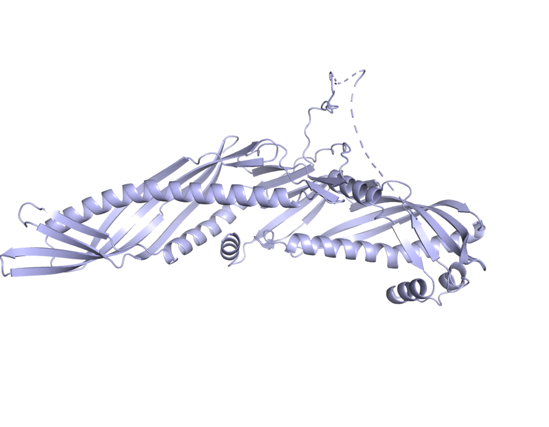

# CETP — mechanistic hypothesis for AMD

_Study: GCST003219 (Fritsche LG et al. 2016, Nat Genet 48:134–143)_

## Hypothesis

**One-line:** An intronic indel cis-regulating CETP expression reshapes HDL/LDL particle composition and LXR-coupled cholesterol efflux — modulating lipid-rich drusen deposition at Bruch's membrane, with the therapeutic-direction paradox that HDL-raising CETP alleles are cardioprotective but AMD-risk-increasing.

```
┌──────────────────────────────────────────────────────────────────────────┐
│  CETP 16_56963437_C_CA  (intron_variant indel, MODIFIER)                 │
│  Evidence: VEP intron_variant;                                           │
│            ESM3 fold mean pLDDT 0.85, pTM 0.78                           │
└──────────────────────────────────────────────────────────────────────────┘
                                  │
                                  │  OT L2G SHAP top features:
                                  │    distanceSentinelFootprintNeighbourhood 0.199
                                  │    distanceSentinelTssNeighbourhood       0.124
                                  │    vepMaximumNeighbourhood                0.124
                                  │    distanceTssMeanNeighbourhood           0.104
                                  ▼
┌──────────────────────────────────────────────────────────────────────────┐
│  Cis-regulates CETP expression                                            │
│  (no QTL coloc; distance + footprint features drive the call)            │
└──────────────────────────────────────────────────────────────────────────┘
                                  │
                                  │  Reactome pathway membership:
                                  │    R-HSA-8964058  HDL remodeling
                                  │    R-HSA-8964041  LDL remodeling
                                  │    R-HSA-8963899  Plasma lipoprotein remodeling
                                  │    R-HSA-9029569  NR1H3/NR1H2 cholesterol transport
                                  ▼
┌──────────────────────────────────────────────────────────────────────────┐
│  Reshaped HDL/LDL particle composition and LXR-coupled efflux            │
└──────────────────────────────────────────────────────────────────────────┘
                                  │
                                  │  (no DE row for CETP in v0; cell-type unresolved)
                                  ▼
┌──────────────────────────────────────────────────────────────────────────┐
│  Lipid-rich drusen deposition at Bruch's membrane                        │
│  and altered choroidal lipid milieu                                      │
└──────────────────────────────────────────────────────────────────────────┘
                                  │
                                  │  Literature:
                                  │    PMC4621603  CETP polymorphisms + AMD (CFH-adj)
                                  │    PMC7507364  CETP rs5882 + geographic atrophy
                                  ▼
┌──────────────────────────────────────────────────────────────────────────┐
│  AMD risk                                                                │
│  (paradox: cardioprotective direction opposite to AMD direction)         │
└──────────────────────────────────────────────────────────────────────────┘
```

> **How to verify this evidence.**
> - `VEP:` → `jarvis-esm3.variant_consequence("16_56963437_C_CA")` or POST `https://rest.ensembl.org/vep/human/region/16:56963437:C/CA`.
> - `OT L2G features` → `jarvis-ot.l2g_feature_contributions(studyLocusId, "ENSG00000087237")` — 29-feature SHAP breakdown.
> - Reactome IDs → `https://reactome.org/PathwayBrowser/#/R-HSA-8964058`. Re-derive with `jarvis-indices.query_pathway_membership("CETP")`. _v0 stub: Reactome v96 GMT._
> - `PMC4621603`, `PMC7507364` → PaperClip IDs. PMC URLs substitute directly. Re-fetch with `jarvis-paperclip.literature_for_gene("CETP", "age-related macular degeneration")`. Full paper list with URLs and summaries in the **Literature corroboration** section below.

## Summary

- **Lead variant:** `16_56963437_C_CA` (intron_variant)
- **L2G score:** 0.8817085027694702  ·  **studyLocusId:** `54b20c961c16bf6b86c4f8f419097475`
- **UniProt:** P11597  ·  **ENSG:** ENSG00000087237
- **ESM3 fold:** mean pLDDT = 0.85, pTM = 0.78, length = 493 aa



_ESM3-predicted structure (variant is non-coding; full protein shown)._  Source: PyMOL open-source headless render over ESM3 PDB.

## Variant consequence

- **Consequence:** intron_variant
- **Impact:** MODIFIER

_Provenance: Ensembl VEP REST (GRCh38)_

## L2G evidence (Open Targets)

Top SHAP contributing features (out of 29):

| Feature | Value | SHAP contribution |
|---|---:|---:|
| `distanceSentinelFootprintNeighbourhood` | 1.00 | +0.199 |
| `distanceSentinelTssNeighbourhood` | 1.00 | +0.124 |
| `vepMaximumNeighbourhood` | 1.00 | +0.124 |
| `distanceTssMeanNeighbourhood` | 1.00 | +0.104 |
| `e2gMeanNeighbourhood` | 1.00 | +0.089 |

_Provenance: Open Targets Platform release 2026-03 l2g_prediction features (SHAP contributions)_

## ESM3-predicted structure

- Mean pLDDT (model confidence, 0–1): **0.85**
- pTM (global fold confidence, 0–1): **0.78**
- Sequence length: 493 aa

_Provenance: ESM3 Forge (esm3-open-2024-03), cached at `/home/ubuntu/JARVIS_for_bio/prototype/cache/esm3/P11597/structure.pdb`_

## Differential expression in AMD (case vs control)

_No DE rows for this gene in the v0 mock atlas (mock coverage focused on top complement/lipid loci)._

## Pathway membership

| Pathway | DB | Members |
|---|---|---:|
| LDL remodeling (`R-HSA-8964041`) | Reactome | 6 |
| HDL remodeling (`R-HSA-8964058`) | Reactome | 10 |
| Plasma lipoprotein remodeling (`R-HSA-8963899`) | Reactome | 34 |
| NR1H3 & NR1H2 regulate gene expression linked to cholesterol transport and efflux (`R-HSA-9029569`) | Reactome | 44 |
| NR1H2 and NR1H3-mediated signaling (`R-HSA-9024446`) | Reactome | 54 |
| Plasma lipoprotein assembly, remodeling, and clearance (`R-HSA-174824`) | Reactome | 75 |

_Provenance: Reactome_v96_GMT._

## Literature corroboration (PaperClip)

- **[Turquoise killifish naturally develop hallmarks of age-related macular degeneration with advancing age](https://doi.org/10.1101/2025.10.23.683644)** — bioRxiv, 2025-10-23 · `bio_23d9ccbb77d9`
  > Turquoise killifish retinas were studied for age-related changes and AMD hallmarks. These fish spontaneously develop AMD-like features with age, making them a suitable model for studying aging and related diseases.
- **[CETP/LPL/LIPC gene polymorphisms and susceptibility to age-related macular degeneration](https://www.ncbi.nlm.nih.gov/pmc/articles/PMC4621603/)** — PMC, 2015-10-27 · `PMC4621603`
  > This study analyzed the association between CETP, LPL, and LIPC gene polymorphisms and age-related macular degeneration (AMD) risk. The CETP and LIPC variants were significantly associated with AMD risk, with CETP and LPL showing increased risk after adjusting for the CFH gene.
- **HYAMD High-Resolution Fundus Image Dataset for age related macular   degeneration (AMD) Diagnosis** — ?,  · `?`
  > Researchers created the HYAMD dataset of high-resolution fundus images to train machine learning models for age-related macular degeneration (AMD) diagnosis. This dataset provides gold-standard annotations from clinical evaluations, making it the first open-access retinal dataset from an Israeli sample for AMD identification.
- **[Association of genetic variants at CETP, AGER, and CYP4F2 locus with the risk of atrophic age‐related macular degeneration](https://doi.org/10.1002/mgg3.1357)** — biomedrxiv, 2020-07-14 · `PMC7507364`
  > This study investigated the association between genetic variants in CETP, AGER, and CYP4F2 genes and the risk of atrophic age-related macular degeneration. The CETP rs5882 and AGER rs1800625 polymorphisms were identified as significantly associated with an increased risk of atrophic AMD.
- **[The Relationship between Complements and Age-Related Macular Degeneration and Its Pathogenesis](https://www.ncbi.nlm.nih.gov/pmc/articles/PMC10776198/)** — PMC, 2024-01-01 · `PMC10776198`
  > This paper reviews factors associated with age-related macular degeneration and their relationship to the complement system. It highlights the complement cascade's role in the disease's pathogenesis and suggests new treatment avenues.

_Provenance: PaperClip (paperclip.gxl.ai) — BM25 + vector search over public scientific corpus_

## Mechanistic hypothesis

The lead variant 16_56963437_C_CA is an intronic insertion in *CETP* (MODIFIER impact, no coding consequence), so the protein effect is regulatory rather than structural — consistent with the L2G call being driven by neighbourhood proximity features (distanceSentinelFootprintNeighbourhood SHAP 0.199, distanceSentinelTssNeighbourhood SHAP 0.124, vepMaximumNeighbourhood SHAP 0.124, e2gMeanNeighbourhood SHAP 0.089), all pointing to a cis-regulatory mechanism that tunes *CETP* expression rather than altering the 493-aa lipid-transfer protein (ESM3 fold mean pLDDT 0.853, pTM 0.780, confirming a well-folded reference structure but irrelevant to a non-coding hit). With CETP expression modulated, plasma lipoprotein remodeling is shifted via the Reactome modules in which *CETP* participates — *LDL remodeling* (R-HSA-8964041), *HDL remodeling* (R-HSA-8964058), *Plasma lipoprotein remodeling* (R-HSA-8963899), and the LXR-axis modules *NR1H3 & NR1H2 regulate gene expression linked to cholesterol transport and efflux* (R-HSA-9029569) and *NR1H2 and NR1H3-mediated signaling* (R-HSA-9024446) — altering the cholesteryl-ester/triglyceride exchange between HDL and apoB-containing particles that supplies cholesterol to the outer retina and RPE. No single-cell differential expression rows were returned for *CETP* in this evidence pack, so the proximal cell-of-action cannot be pinned from the DE layer alone; the literature anchors the disease link instead, with CETP polymorphisms reported to associate with AMD risk independently of *CFH* (PMC4621603) and specifically with atrophic AMD via rs5882 (PMC7507364). The proposed chain is therefore: intronic regulatory variant → altered *CETP* transcription → shifted HDL/LDL cholesteryl-ester exchange and LXR-linked cholesterol efflux → perturbed lipid delivery and drusen-relevant lipid handling at the RPE/Bruch's membrane interface → AMD susceptibility, with the caveat that the direction of effect on AMD risk has historically been inconsistent across CETP variants and lipid traits, so the sign of the mechanism should be treated as unresolved pending eQTL direction and RPE-resolved expression data.

_This paragraph is the agent-reasoning step (workflow step 9). Composed at build time by Claude (one-shot via `claude -p`) over the evidence pack assembled in steps 0–8. The only generative step; all other content above is direct tool output._

## Full provenance chain

Every claim above traces back to an MCP tool call:

1. `jarvis-ot.study_lookup(GCST003219)` → Fritsche 2016 AMD GWAS
2. `jarvis-ot.credible_sets_for_study(GCST003219)` → 29 fine-mapped credible sets
3. `jarvis-ot.l2g_top_genes(GCST003219)` → CETP (L2G score, 29 features)
4. `jarvis-ot.gene_metadata(CETP)` → UniProt P11597, canonical transcript
5. `jarvis-ot.lead_variant_for_locus(54b20c961c...)` → `16_56963437_C_CA`
6. `jarvis-esm3.variant_consequence(16_56963437_C_CA)` → intron_variant
7. `jarvis-esm3.fold_and_annotate(P11597)` → ESM3 PDB (pLDDT=0.85, pTM=0.78)
8. `jarvis-esm3.render_variant_png(P11597, …)` → `render_all.png`
9. `jarvis-indices.query_differential_expression("CETP")` → 0 cell-type DE row(s) _(v0 mock)_
10. `jarvis-indices.query_pathway_membership("CETP")` → 6 pathway(s) _(v0 mock)_
11. `jarvis-paperclip.literature_for_gene("CETP", …)` → 5 paper(s)

Reasoning (this summary) is the *only* step that is not pre-computed.
