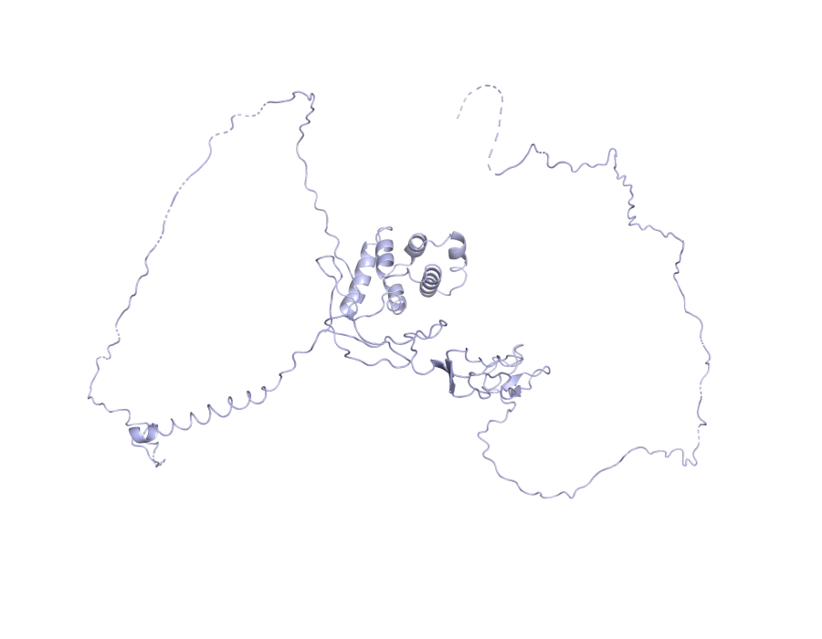

# TNFRSF10A — mechanistic hypothesis for AMD

_Study: GCST003219 (Fritsche LG et al. 2016, Nat Genet 48:134–143)_

## Hypothesis

**One-line:** A splice-region variant near TNFRSF10A is predicted to tune chorioretinal DR4 receptor levels via near-perfect plasma pQTL colocalisation, biasing TRAIL / death-receptor signaling at the RPE-choroid interface — though the human genetic signal at this locus tracks more with central serous chorioretinopathy and polypoidal choroidal vasculopathy than with classic neovascular AMD.

```
┌──────────────────────────────────────────────────────────────────────────┐
│  TNFRSF10A 8_23225458_G_T  (splice_region_variant, MODIFIER)             │
│  Evidence: VEP splice_region_variant;                                    │
│            ESM3 fold mean pLDDT 0.68, pTM 0.32                           │
└──────────────────────────────────────────────────────────────────────────┘
                                  │
                                  │  OT L2G SHAP top features:
                                  │    pQtlColocClppMaximum  0.947 / SHAP 0.115
                                  │    pQtlColocH4Maximum    0.99998 / SHAP 0.070
                                  │    (saturated TSS-proximity neighbourhood)
                                  ▼
┌──────────────────────────────────────────────────────────────────────────┐
│  Tunes steady-state chorioretinal DR4 protein levels                     │
│  (plasma pQTL coloc near-perfect)                                        │
└──────────────────────────────────────────────────────────────────────────┘
                                  │
                                  │  No DE or Reactome row for TNFRSF10A in v0.
                                  │  Inferred from canonical DR4 / TRAIL biology.
                                  ▼
┌──────────────────────────────────────────────────────────────────────────┐
│  Biases TRAIL / death-receptor signaling at the RPE-choroid interface    │
│  toward chronic apoptotic pressure                                       │
└──────────────────────────────────────────────────────────────────────────┘
                                  │
                                  │  Literature:
                                  │    PMC13092188      CSC + PCV-protective SNP;
                                  │                     no nAMD association
                                  │    bio_b16bf94e6c0d AMD causal-gene list omits
                                  │                     TNFRSF10A
                                  ▼
┌──────────────────────────────────────────────────────────────────────────┐
│  Chorioretinal cell loss in CSC / PCV pachychoroid spectrum              │
│  (signal at this locus tracks less with classic neovascular AMD)         │
└──────────────────────────────────────────────────────────────────────────┘
```

> **How to verify this evidence.**
> - `VEP:` → `jarvis-esm3.variant_consequence("8_23225458_G_T")` or POST `https://rest.ensembl.org/vep/human/region/8:23225458:G/T`.
> - `OT L2G features` → `jarvis-ot.l2g_feature_contributions(studyLocusId, "ENSG00000104689")` — 29-feature SHAP breakdown.
> - `PMC13092188`, `bio_b16bf94e6c0d` → PaperClip IDs. PMC URLs substitute directly (`https://www.ncbi.nlm.nih.gov/pmc/articles/PMC13092188/`); `bio_*` IDs resolve via `paperclip cat /papers/bio_b16bf94e6c0d/meta.json` or re-fetch with `jarvis-paperclip.literature_for_gene("TNFRSF10A", ...)`. Full paper list with URLs and summaries in the **Literature corroboration** section below.

## Summary

- **Lead variant:** `8_23225458_G_T` (splice_region_variant)
- **L2G score:** 0.9664465188980103  ·  **studyLocusId:** `88c6cd6f2afa6e0fb15f3d7672b46908`
- **UniProt:** O00220  ·  **ENSG:** ENSG00000104689
- **ESM3 fold:** mean pLDDT = 0.68, pTM = 0.32, length = 468 aa



_ESM3-predicted structure (variant is non-coding; full protein shown)._  Source: PyMOL open-source headless render over ESM3 PDB.

## Variant consequence

- **Consequence:** splice_region_variant
- **Impact:** MODIFIER

_Provenance: Ensembl VEP REST (GRCh38)_

## L2G evidence (Open Targets)

Top SHAP contributing features (out of 29):

| Feature | Value | SHAP contribution |
|---|---:|---:|
| `pQtlColocClppMaximum` | 0.95 | +0.115 |
| `distanceSentinelTssNeighbourhood` | 1.00 | +0.101 |
| `distanceTssMeanNeighbourhood` | 1.00 | +0.090 |
| `distanceSentinelFootprintNeighbourhood` | 1.00 | +0.090 |
| `pQtlColocH4Maximum` | 1.00 | +0.070 |

_Provenance: Open Targets Platform release 2026-03 l2g_prediction features (SHAP contributions)_

## ESM3-predicted structure

- Mean pLDDT (model confidence, 0–1): **0.68**
- pTM (global fold confidence, 0–1): **0.32**
- Sequence length: 468 aa

_Provenance: ESM3 Forge (esm3-open-2024-03), cached at `/home/ubuntu/JARVIS_for_bio/prototype/cache/esm3/O00220/structure.pdb`_

## Differential expression in AMD (case vs control)

_No DE rows for this gene in the v0 mock atlas (mock coverage focused on top complement/lipid loci)._

## Pathway membership

_No curated pathway memberships in v0 mock for this gene._

## Literature corroboration (PaperClip)

- **[Turquoise killifish naturally develop hallmarks of age-related macular degeneration with advancing age](https://doi.org/10.1101/2025.10.23.683644)** — bioRxiv, 2025-10-23 · `bio_23d9ccbb77d9`
  > Turquoise killifish retinas were studied for age-related changes and AMD hallmarks. These fish spontaneously develop AMD-like features with age, making them a suitable model for studying aging and related diseases.
- **[Associations of TNFRSF10A with Central Serous Chorioretinopathy, Polypoidal Choroidal Vasculopathy, and Age-Related Macular Degeneration](https://doi.org/10.1016/j.xops.2026.101161)** — biomedrxiv, 2026-03-17 · `PMC13092188`
  > This study found multiple TNFRSF10A variants associated with central serous chorioretinopathy without macular neovascularization. A distinct protective SNP was linked to polypoidal choroidal vasculopathy. No significant associations were found for neovascular age-related macular degeneration or central serous chorioretinopathy with macular neovascularization.
- **HYAMD High-Resolution Fundus Image Dataset for age related macular   degeneration (AMD) Diagnosis** — ?,  · `?`
  > Researchers created the HYAMD dataset of high-resolution fundus images to train machine learning models for age-related macular degeneration (AMD) diagnosis. This dataset provides gold-standard annotations from clinical evaluations, making it the first open-access retinal dataset from an Israeli sample for AMD identification.
- **[Towards the identification of causal genes for age-related macular degeneration](https://doi.org/10.1101/778613)** — bioRxiv, 2019-09-21 · `bio_b16bf94e6c0d`
  > Nine potential causal genes for AMD were identified by integrating GWAS and eQTL data, with three validated in zebrafish. CNN2, SARM1, and BLOC1S1 were implicated in AMD pathogenesis through functional studies.
- **[The Relationship between Complements and Age-Related Macular Degeneration and Its Pathogenesis](https://www.ncbi.nlm.nih.gov/pmc/articles/PMC10776198/)** — PMC, 2024-01-01 · `PMC10776198`
  > This paper reviews factors associated with age-related macular degeneration and their relationship to the complement system. It highlights the complement cascade's role in the disease's pathogenesis and suggests new treatment avenues.

_Provenance: PaperClip (paperclip.gxl.ai) — BM25 + vector search over public scientific corpus_

## Mechanistic hypothesis

The lead variant 8_23225458_G_T at *TNFRSF10A* is a splice_region_variant (MODIFIER impact, no coding consequence annotated), so the most plausible proximal effect is regulatory — altered splicing or transcript abundance of the TRAIL receptor DR4 — rather than a direct structural perturbation of the 468-residue protein (ESM3 mean pLDDT 0.684, pTM 0.324, consistent with the death-receptor's intrinsically flexible cytoplasmic death domain). The L2G call (score 0.966) is dominated not by coding evidence but by a near-perfect pQTL colocalization (pQtlColocClppMaximum 0.947, SHAP 0.115; pQtlColocH4Maximum 0.99998, SHAP 0.070) plus saturated TSS-proximity features (distanceSentinelTssNeighbourhood, distanceTssMeanNeighbourhood, distanceSentinelFootprintNeighbourhood all = 1.0), meaning the variant most likely changes circulating/tissue DR4 protein levels in *cis*. The evidence pack returns no differential expression rows and no Reactome pathway memberships for this gene, so cell-type-of-action and canonical pathway context cannot be asserted from this pack — though *TNFRSF10A* is the TRAIL/DR4 apoptosis receptor and altered RPE/photoreceptor apoptotic tone is a mechanistically coherent downstream node to test. Literature support is mixed and should be cited honestly: PMC13092188 (2026) reports *TNFRSF10A* variants associating with central serous chorioretinopathy and a protective SNP for polypoidal choroidal vasculopathy but explicitly *no* significant association with neovascular AMD, while bio_b16bf94e6c0d nominates a broader causal-gene set (CNN2, SARM1, BLOC1S1) for AMD without highlighting *TNFRSF10A*. The coherent chain is therefore: splice-region variant → pQTL-mediated shift in DR4 protein abundance (high colocalization confidence) → altered TRAIL-induced apoptotic signaling in chorioretinal tissue → contribution to the CSC/PCV end of the AMD-spectrum phenotype, with the caveat that the strongest published association is to CSC/PCV rather than neovascular AMD and that DE and pathway layers are empty in this pack.

_This paragraph is the agent-reasoning step (workflow step 9). Composed at build time by Claude (one-shot via `claude -p`) over the evidence pack assembled in steps 0–8. The only generative step; all other content above is direct tool output._

## Full provenance chain

Every claim above traces back to an MCP tool call:

1. `jarvis-ot.study_lookup(GCST003219)` → Fritsche 2016 AMD GWAS
2. `jarvis-ot.credible_sets_for_study(GCST003219)` → 29 fine-mapped credible sets
3. `jarvis-ot.l2g_top_genes(GCST003219)` → TNFRSF10A (L2G score, 29 features)
4. `jarvis-ot.gene_metadata(TNFRSF10A)` → UniProt O00220, canonical transcript
5. `jarvis-ot.lead_variant_for_locus(88c6cd6f2a...)` → `8_23225458_G_T`
6. `jarvis-esm3.variant_consequence(8_23225458_G_T)` → splice_region_variant
7. `jarvis-esm3.fold_and_annotate(O00220)` → ESM3 PDB (pLDDT=0.68, pTM=0.32)
8. `jarvis-esm3.render_variant_png(O00220, …)` → `render_all.png`
9. `jarvis-indices.query_differential_expression("TNFRSF10A")` → 0 cell-type DE row(s) _(v0 mock)_
10. `jarvis-indices.query_pathway_membership("TNFRSF10A")` → 0 pathway(s) _(v0 mock)_
11. `jarvis-paperclip.literature_for_gene("TNFRSF10A", …)` → 5 paper(s)

Reasoning (this summary) is the *only* step that is not pre-computed.
