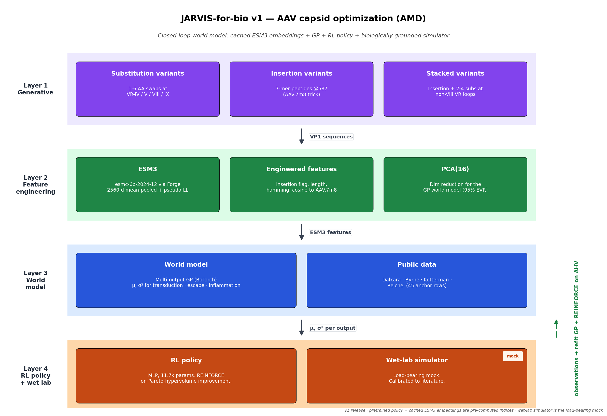

# JARVIS-for-bio v1: AMD AAV Capsid Optimization

The **Experiment** leg of the JARVIS-for-bio trinity. v0 surfaced complement
gene C9 from an AMD GWAS; v1 acts on the hypothesis by optimizing **AAV2
capsids** to deliver **soluble CD59** to retinal pigment epithelium (RPE)
via the intravitreal route.

A small RL policy is **pretrained on a biologically grounded simulator**,
then deployed in a 10-cycle closed loop to explore the Pareto frontier of
**RPE transduction × neutralizing-antibody escape** under an
**inflammation-safety constraint**.

## Architecture



Regenerate with `python visualization/world_model.py`.

## The load-bearing mock

The wet-lab simulator (`pipeline/layer4_closed_loop/wet_lab_simulator.py`)
is the only synthetic component. It is calibrated against published
intravitreal AAV literature — Dalkara 2013 (AAV.7m8), Byrne 2020
(4D-R100), Kotterman 2015 (vitreal NAb escape), Reichel 2017 + Bucher
2021 (inflammation) — but it is **not** a wet lab. Every other layer
(AAV2 VP1 sequences from NCBI, ESM3 embeddings via Forge, GP world model,
RL policy, SQLite store) is real. Every simulator-sourced row in
`outputs/pareto_data.parquet` carries `is_simulated=True` and
`source_version='simulator_v1.0'`. The figures footer the simulator
visibly.

## Setup

```bash
# 1. Dependencies (uses the shared project venv)
~/venv/bin/pip install -r requirements.txt

# 2. ESM3 Forge token
cp .env.example .env
# Add your token to .env: ESM3_API_TOKEN=...

# 3. Fetch real sequences
~/venv/bin/python scripts/fetch_sequences.py        # AAV2 VP1 from NCBI YP_680426.1
~/venv/bin/python scripts/build_aav7m8_reference.py # AAV2 + LALGETTRP @ 587-588

# 4. Generate ~80 capsid variants (VR-loop substitutions + 7-mer insertions)
~/venv/bin/python -m pipeline.layer1_generative.capsid_generator

# 5. Embed every sequence with ESM3 (cached to data/embeddings/esm3/*.h5)
~/venv/bin/python -m pipeline.layer2_features.esm3_embedder

# 6. Seed public pre-training CSVs
~/venv/bin/python scripts/seed_public_data.py

# 7. Pretrain the RL policy on the simulator (~2 min, 300 campaigns)
~/venv/bin/python scripts/pretrain_policy.py        # -> data/pretrained_policy.pt

# 8. Run the pipeline + write SQLite + export outputs
~/venv/bin/python main.py

# 9. Render figures
~/venv/bin/python visualization/pareto.py
~/venv/bin/python visualization/rl_vs_random.py
```

## Outputs

| File | What it is |
|---|---|
| `data/results.db` | SQLite source of truth (3 tables) |
| `outputs/variants.fasta` | 82 synthesizable capsids (80 generated + AAV2 + AAV.7m8) |
| `outputs/pareto_data.parquet` | One row per (candidate, cycle); the table that draws the figure |
| `outputs/closed_loop_summary.csv` | 20 rows (10 cycles × 2 strategies) |
| `outputs/pareto_frontier.png` | Headline figure: RL exploration of the Pareto frontier |
| `outputs/rl_vs_random.png` | Hypervolume convergence: RL vs random baseline |

## Architecture notes

**Inputs to the policy per candidate (26-d vector):**
- 16-d PCA of the 2560-d ESM3 embedding
- 4 engineered features (`has_7mer_insertion`, `insertion_length`,
  `hamming_to_aav2`, `cosine_to_aav7m8_embedding`)
- 6-d world-model output (mean + variance for `rpe_transduction`,
  `neut_escape`, `inflammation_score`)

**Policy:** 2-layer MLP, 11,777 parameters. Output: scalar
`selection_score`. Selection: Gumbel-top-k over constraint-passing
candidates. Training: REINFORCE on Pareto-hypervolume improvement with
EMA reward baseline.

**Pretraining:** 300 simulated 10-cycle campaigns × 5 picks/cycle.
World-model GP refits use default kernel hyperparameters (skipping MLL
maximization) for ~80× speedup; the live run does the same. Total wall
time on CPU: ~140 s.

**The closed loop is defined by what feeds it.** v1's evidence source is
the simulator. v2+ swaps in the real wet lab (Opentrons-driven AAV
production + HTRF/qPCR readouts). The `EvidenceSource` protocol is the
contract; the policy is unchanged.

## Threading from v0

v0 (Explore) ran the Fritsche 2016 AMD GWAS through the inference-oriented
architecture and surfaced **C9** (rank 3, L2G 0.961, intronic regulatory)
as a top hit, with the hypothesis:

> An intronic variant cis-regulating C9 expression raises local complement
> C9 dosage in the RPE-choroid, biasing the terminal complement pathway
> toward more efficient C5b-9 (MAC) assembly on Bruch's membrane.

v1 acts on that hypothesis by delivering **sCD59** (which neutralizes MAC
assembly locally) via engineered AAV capsids — the HMR59 / JNJ-1887
clinical precedent. The cassette is fixed; the **capsid** is the design
variable.

## Key references

- Dalkara D et al. 2013, *Sci Transl Med* 5:189ra76 — AAV.7m8 directed evolution
- Byrne LC et al. 2020, *J Clin Invest* 130:4214 — engineered intravitreal capsids
- Kotterman MA et al. 2015, *Gene Ther* 22:116 — vitreal NAb escape (NHP)
- Calcedo R et al. 2009, *J Infect Dis* 199:381 — global AAV2 seroprevalence
- Cashman SM et al. 2011, *Mol Ther* 19:1640 — secreted-sCD59 AAV cassette design
- Fritsche LG et al. 2016, *Nat Genet* 48:134 — AMD GWAS (the v0 input study)
