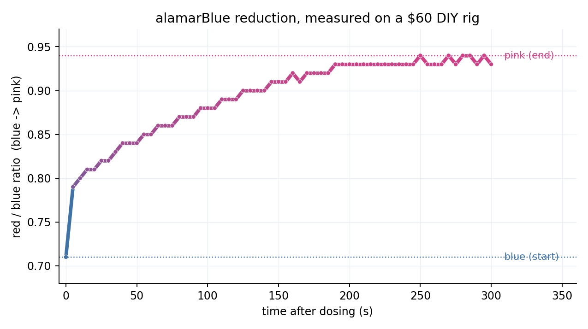

# Benchmate Rig — a low-cost colorimetric viability reader

A ~$60, solder-light DIY instrument that reads the **blue → pink** color change of
**alamarBlue (resazurin)** — the readout for cell viability — and can dose liquid
with a pump under closed-loop control. It's the wet-lab half of
[Benchmate](https://github.com/nataliegits/Benchmate): turn a hypothesis into a
dosing + measurement, and feed the result back as evidence.

Built and tested at home with no cells, using alamarBlue + a chemical reductant
(sodium dithionite or vitamin C) as a stand-in for living cells' metabolism.

> **Why blue→pink?** Metabolically *live* cells reduce resazurin (blue) to
> resorufin (pink). More pink = more viable. A cheap RGB sensor reads that as a
> rising **red/blue ratio** — the same signal whether driven by cells or by a
> chemical reductant.

---

## Hardware (~$60, mostly solder-free)

| Part | Role |
|------|------|
| Raspberry Pi Pico 2 | controller (MicroPython, talks over USB) |
| TCS34725 RGB color sensor | reads the well's color (blue ↔ pink) |
| 12 V peristaltic pump + tubing | doses reductant / drug into the well |
| Dual MOSFET trigger module | lets the 3.3 V Pico switch the 12 V pump |
| 12 V 2 A power supply (+ barrel-screw adapter) | powers the pump |
| Jumper wires, 6-well plate | wiring + vessel |
| alamarBlue + reductant (vitamin C or sodium dithionite) | the chemistry |

## Wiring

**Sensor → Pico (I²C):** `VIN→3V3` · `GND→GND` · `SDA→GP0` · `SCL→GP1` · `LED→3V3`

**Pump (via MOSFET):** `MOSFET TRIG/PWM → GP15` · `MOSFET GND → Pico GND` ·
`12 V supply → VIN+/VIN−` · `pump → OUT+/OUT−`

The Pico is powered over USB; the 12 V supply powers only the pump through the
MOSFET. All grounds share a common reference via the MOSFET GND → Pico GND link.
See `docs/` and the project deck for the full build.

---

## The code

### `firmware/` — runs **on the Pico** (MicroPython)
Open each in [Thonny](https://thonny.org) and click **Run** (don't save as
`main.py` — a looping `main.py` auto-runs on boot and locks the board).

- **`sensor_test.py`** — reads the color once a second and prints R/G/B + red/blue.
  Wave something blue then pink near it to confirm the sensor works. Runs an I²C
  scan first and tells you which wire to check if it's not found.
- **`pump_test.py`** — runs the pump for 2 seconds. Confirms the pump + MOSFET +
  12 V path works.
- **`pump_and_watch_color.py`** — the real experiment: read the blue baseline,
  pump in reductant, then watch the color every few seconds and print a summary
  with your **BLUE** and **PINK** calibration numbers.

### `host/` — runs **on your laptop** (optional, the Benchmate integration)
The next phase: drive the rig from Python and feed results to Benchmate. Not
required for the on-Pico scripts above.

- **`benchmate_titrator.py`** — closed-loop titration controller + a zero-hardware
  `demo` (`python benchmate_titrator.py demo`) that runs the whole loop in
  simulation and prints a blue→pink curve.
- **`benchmate_hardware.py`** — a `run_experiment()` bridge that validates a
  protocol, simulates by default, requires human approval for real runs, and logs
  viability time-series to `data/rig/` for Benchmate's agents to read.
- **`plot_run.py`** — turns a run CSV into a slide-ready blue→pink curve PNG.

---

## Quickstart (on the Pico)

1. Flash MicroPython onto the Pico (Thonny → *Install MicroPython* → RP2 / Pico 2).
2. Wire the sensor (4 wires) → run `firmware/sensor_test.py` → confirm color reads.
3. Wire the pump (via MOSFET + 12 V) → run `firmware/pump_test.py` → confirm it pumps.
4. Put 1:10-diluted alamarBlue in a well on the sensor, reductant in the pump line →
   run `firmware/pump_and_watch_color.py` → watch blue→pink and record the summary.

## Safety

- Never drive the pump straight off a Pico pin — always through the MOSFET on 12 V.
- Tie all grounds together; confirm the 12 V adapter polarity before powering.
- Sodium dithionite: gloves, ventilation, keep dry, never mix with acid, make
  fresh dilute solutions. Vitamin C is a gentler, food-grade alternative.

## First real result

Driving alamarBlue blue→pink with a chemical reductant, read live by the rig:

The red/blue ratio rose from **0.71 (blue / oxidized)** to **0.94 (pink / reduced)**
over ~5 minutes — a clean reduction curve measured entirely on the $60 build.
Raw data: [`results/alamarblue_run.csv`](results/alamarblue_run.csv). Those two
values are the calibration points (`BENCHMATE_DEAD_INDEX = 0.71`,
`BENCHMATE_LIVE_INDEX = 0.94`).

## Status

Sensor ✅ · pump ✅ · combined read-and-pump ✅ · first alamarBlue run ✅. Next:
scale to a 6-well plate for dose-response curves, then wire `host/` to Benchmate
so hypotheses drive real measurements.
