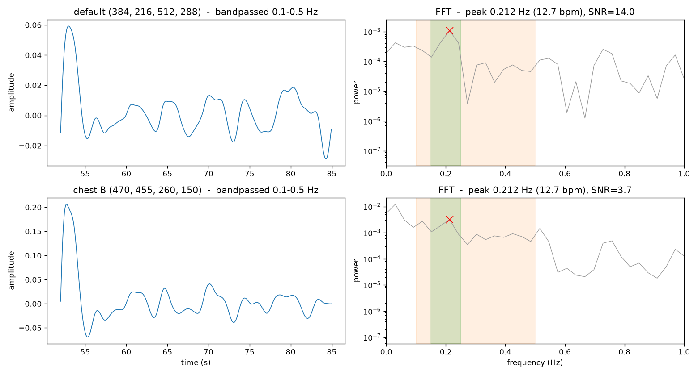

# breath-cam
Proof of concept: recovering a breathing signal from an ordinary phone camera, no
contact, no wearable.

## Result
From a 2-minute clip of a supine subject in a lit room, the pipeline recovers a clean
respiratory signal: a sharp spectral peak at 0.21 Hz (12.7 breaths/min), inside the
normal resting range. The finding is corroborated by two independent regions of
interest that both land on the same 0.21 Hz, which is what distinguishes a real
breathing signal from a per-ROI artifact.

## How it works
1. Pick a region of interest (ROI) over the chest/abdomen.
2. Reduce each frame to one number via vertical optical-flow magnitude in the ROI.
3. Bandpass the resulting trace to 0.1 to 0.5 Hz.
4. Take the FFT and read the peak frequency in the breathing band. That peak is the
   respiratory rate.

## What this does NOT yet show
This is a single clip, a single calm window, normal breathing, lit room, subject
still. It demonstrates the signal is recoverable. It does not yet show the signal
survives movement (fidgets already disrupt the rate estimate), darkness, or a full
night, and it has not yet been validated against an independent mechanical reference.

## Next
- Designed protocol clip: metronome-paced breathing plus a breath-hold, to confirm the
  recovered rate tracks a known rate and the peak vanishes during apnea.
- Respiratory belt as independent ground truth (camera-vs-belt, not camera-vs-itself).
- Darkness and depth-camera path for the real sleep setting.

## Run
python3 extract.py <clip.mov>
python3 eval_rois.py   # ROI comparison on a calm window
